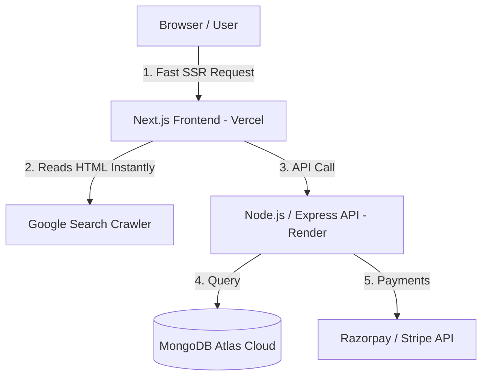

# Indra's Leafs & Fragrances
## Web Re-Branding, Technical Development & Marketing Proposal

This proposal outlines the strategy, technical stack, cost estimates, timelines, and digital marketing roadmap for the online transition and re-branding of **Indra's Leafs & Fragrances**. It answers all 13 client questions in detail to establish a premium, scalable, and SEO-optimized e-commerce presence.

---

## 1. Executive Summary & Brand Alignment

Indra's Leafs & Fragrances is transitioning from a hybrid model (where online sales were inactive and offline sales occurred via a physical café and partnership with Golden Tips) to a modern, fully digital direct-to-consumer (D2C) e-commerce storefront. 

Our core objectives are:
1. **Complete Brand Re-vamp:** Scraping the outdated WordPress site and building a high-end, responsive, fast web app.
2. **SEO Dominance:** Ranking high on search engines for Darjeeling first/second flush teas and premium tea bar experiences.
3. **Omnichannel Synergy:** Connecting the Kolkata tea bar with the national e-commerce platform to build a loyal community.

---

## 2. Answers to Client Questions

### Q1: Social Media Post Frequency Audit
An audit of the provided profiles indicates that the brand has **no visible active public presence** or the URLs point to inactive/under-construction handles:
- **Facebook, Instagram, X, LinkedIn:** All profiles show a **current post frequency of zero**.
- **Impact:** This lack of activity hurts trust. When a user lands on the website and clicks social links, dead pages lead to high cart abandonment.
- **Goal:** Establish a consistent posting cadence of **3–4 high-quality posts per week** (including at least 2 Reels/Shorts) to signal brand health.

---

### Q2: Domain Name Strategy & SEO
The current domain, `lnf-indra.co.in`, is not SEO-friendly. It is hard to type, contains an acronym ("lnf") that lacks search volume, and uses a secondary TLD (`.co.in`). 
To rank up in search engines and make the brand memorable, we propose:

| Proposed Domain | Target SEO Keywords | Pros / Cons | Est. Cost (INR/Year) |
| :--- | :--- | :--- | :--- |
| **`indrasteas.com`** *(Recommended)* | Indra, Teas | **Pros:** Short, premium, global credibility (.com), easy to recall. | ₹1,000 |
| **`indrasleafs.in`** | Indra, Leafs, India | **Pros:** Direct tie-in with branding, great for domestic SEO. | ₹700 |
| **`leafsandfragrances.com`** | Leafs, Fragrances | **Pros:** Matches exact business name. **Cons:** Long to type. | ₹1,000 |
| **`darjeelingteasbyindra.com`** | Darjeeling Teas, Indra | **Pros:** High SEO keyword density. **Cons:** Too long. | ₹1,000 |

> [!TIP]
> **SEO Action:** Purchase both **`indrasteas.com`** (main site) and **`indrasleafs.in`** (redirects to the main site) to protect the brand and capture both domestic and international traffic.

---

### Q3: Stack Evaluation: MERN vs. Next.js
While a standard MERN (MongoDB, Express, React, Node) stack is proposed, a plain React Client-Side Rendered (CSR) Single Page Application has major SEO disadvantages:
- **The SEO Problem:** Search engine crawlers (like Googlebot) struggle to index JavaScript-rendered text efficiently, resulting in poor search engine page ranks.
- **The Solution (Next.js):** We recommend using **Next.js** instead of plain React. Next.js uses the exact same React components but compiles them on the server side (Server-Side Rendering - SSR). This gives crawlers clean HTML instantly, maximizing page speed and SEO.

---

### Q4: Facebook Marketing Strategy
Facebook is excellent for community building and targeting older, high-intent demographics (tea connoisseurs, gift buyers, health enthusiasts).
- **Organic Strategy:**
  - Establish a "Darjeeling Heritage" series: Post stories about tea estates, harvesting flushes, and the art of tea tasting.
  - Create a private community group: "Indra's Tea Connoisseurs Club" for exclusive discounts and brewing sessions.
- **Paid Ads Strategy:**
  - **Local Ads (Radius 5–10km around RamGarh/Kolkata):** Drive foot traffic to the physical outlet by promoting evening snack combos and the tea bar experience.
  - **National Catalog Ads:** Showcase carousel ads of first flush cans and paper box gift packs to pan-India buyers.

---

### Q5: Instagram Marketing Strategy
Instagram is highly visual and key to engaging younger audiences (aged 18–35) who frequent cafés and value premium packaging.
- **Visual Grid Aesthetic:** Clean, earthy green and warm gold tones. Focus on premium product close-ups (the texture of dry leaves, the golden hue of first flush liquor).
- **Reels & Video Content:**
  - "Behind the Brew" guides showing correct water temperatures and steeping times for different flushes.
  - "Café Aesthetic" reels capturing the cozy, sensory vibe of the physical tea bar.
- **Influencer Partnerships:** Send curated "PR Sample Boxes" to Kolkata-based lifestyle, wellness, and culinary influencers.
- **Instagram Shopping:** Enable product tagging so users can click a post and purchase the tea directly.

---

### Q6 & Q7: Facebook & Instagram Setup & Ad Costs
All costs are estimated in Indian Rupees (INR) including GST.

1. **Profile Setup & Branding (One-time):**
   - **Cost:** **Free** to create.
   - **Graphic Design & Setup:** **₹5,000 to ₹12,000** (creating high-quality logo variations, cover photos, Story highlight covers, and bio copy optimization).
2. **Paid Advertising Budget (Monthly recurring):**
   - **Estimated Metrics in India (2026):**
     - **CPC (Cost Per Click):** ₹6 to ₹22.
     - **CPM (Cost Per 1,000 Impressions):** ₹90 to ₹220.
   - **Recommended Advertising Budgets:**
     - *Starter Plan:* **₹10,000/month** (approx. ₹330/day) — split 70% national (e-commerce sales) and 30% local (café foot traffic).
     - *Growth Plan:* **₹25,000/month** (approx. ₹830/day) — allows for retargeting ads and video promotions.

---

### Q8: Verified Social Media & Promotion Strategy
Based on the inactive status of the current profiles, we propose a unified **Offline-to-Online (O2O) loop** to build traction fast:

1. **Table-Top QR Codes:** Place premium wooden acrylic stands on the tables at the Kolkata tea bar.
   - *"Scan to get 10% off your bill today & follow us on Instagram!"*
2. **Interactive Packaging:** Print a QR code on the paper boxes and steel cans linking to a digital "Tea Journey" video explaining the origin of that specific flush.
3. **The "Social Brew" Initiative:** Customers who post a photo of their tea/snacks at the bar, tagging `@leafsnfragnances`, get a free tea-tasting sample.

---

### Q9: Payment Gateway Costs (Stripe vs. Razorpay)
Stripe in India is currently in preview/invite-only mode, with strict regulatory compliance required for onboarding. We recommend **Razorpay** as the primary domestic payment gateway, with Stripe optional for international expansion.

#### Option A: Razorpay (Recommended for domestic launch)
- **Setup Fee & Annual Maintenance Cost (AMC):** **₹0 (Free)**
- **Domestic Transaction Fees:** **2.0% + 18% GST** (Effective fee: **2.36%**) per transaction. Applies to UPI, Cards, Netbanking, Wallets.
- **International Transaction Fees:** **3.0% + 18% GST** (Effective fee: **3.54%**).

#### Option B: Stripe (Recommended for international markets)
- **Setup Fee & AMC:** **₹0 (Free)**
- **Transaction Fees:** **2.0%** (Domestic credit/debit) and **3.0% – 4.3%** (International) **+ 18% GST**.
- **Developer Integration Cost (One-time):** **₹15,000 to ₹25,000** to code Stripe/Razorpay secure checkouts, webhook systems, automatic order tracking, and receipt emails.

---

### Q10: Project Timeline
The estimated development lifecycle is **12 weeks** (approx. 3 months).

```mermaid
gantt
    title Website Development Timeline (12 Weeks)
    dateFormat  W
    axisFormat  Week %W
    
    section UI/UX Design
    Wireframes & Figma Mockups      :active, w1, after start, 2w
    Design Review & Approvals       :w2, after w1, 1w
    
    section Frontend Dev (Next.js)
    Core Layout & Pages (Next.js)   :w3, after w2, 3w
    Interactivity & Cart            :w4, after w3, 2w
    
    section Backend & DB
    API & MongoDB Schema            :w5, after w2, 3w
    Admin Dashboard                 :w6, after w5, 2w
    
    section Integrations & QA
    Razorpay/Stripe & Email setup  :w7, after w6, 2w
    Testing, SEO Optimization & Launch:w8, after w7, 1w
```

- **Week 1–3:** UI/UX wireframes (Figma) for Mobile and Desktop layouts.
- **Week 4–7:** Frontend Next.js responsive implementation & Backend API development.
- **Week 8–9:** Admin Dashboard (to let the client upload products, manage café menus, and track sales).
- **Week 10–11:** Razorpay/Stripe integration, testing checkouts, and configuring system emails.
- **Week 12:** SEO final check, speed optimization, and production deployment.

---

### Q11: Custom Development Costs (MERN/Next.js)
This cost represents standard professional design & development agency rates in India. It excludes ongoing hosting and third-party API fees:

*   **UI/UX Design (Figma):** ₹30,000 – ₹50,000
*   **Frontend Development (Next.js):** ₹60,000 – ₹1,10,000
*   **Backend, Admin Portal & API Development:** ₹50,000 – ₹90,000
*   **QA, Security Audits & Deployment:** ₹10,000 – ₹20,000
*   **Total Custom Development Estimate:** **₹1,50,000 to ₹2,70,000** (One-time fee)

---

### Q12: Hosting Platforms & Estimated Costs
To ensure high-performance, fast page speeds (essential for SEO), we recommend separating the Frontend and the Backend hosting.

| Component | Platform | Plan Details | Cost (INR/Month) | Cost (INR/Year) |
| :--- | :--- | :--- | :--- | :--- |
| **Frontend (Next.js)** | **Vercel** | Hobby Plan (Free) initially; upgrade to **Vercel Pro** for commercial scale. | Free / ₹1,680 ($20) | ₹20,160 |
| **Backend API** | **Render** | **Starter Web Service** (Ensures no cold starts/sleep cycles). | ₹580 ($7) | ₹6,960 |
| **Domain** | **GoDaddy / Namecheap** | Brand registration (`.com` and `.in`). | N/A | ₹1,700 |
| **Transactional Email**| **Resend / SendGrid** | Transactional emails (receipts, sign-ups) up to 3,000/month. | **Free** | Free |
| **Total Estimated Hosting:** | | | **₹2,260/month** | **₹28,820/year** |

---

### Q13: MongoDB Database Strategy & Cost
We recommend using **MongoDB Atlas** (official cloud hosting), which scales dynamically.

1. **Launch Phase: M0 Sandbox Plan**
   - **Cost:** **Free** (512MB storage).
   - **Scope:** Excellent for development and early testing.
2. **Growth Phase: M2 Shared Cluster Plan** *(Recommended for Launch)*
   - **Cost:** **₹750/month ($9/month)**.
   - **Scope:** 2GB storage (enough for ~50,000 customer orders and 1,000 products), basic automated backups, and shared RAM.
3. **Scale Phase: M10 Dedicated Cluster Plan**
   - **Cost:** **₹4,800/month ($57/month)**.
   - **Scope:** Dedicated CPU/RAM, automatic point-in-time recovery backups, 10GB storage, and faster query performance under high traffic.

---

## 3. Consolidated Financial Overview

Here is a summary of the total budget for the website re-branding, custom development, and digital marketing launch in INR.

| Expense Category | Frequency | Budget Range (INR) | Notes |
| :--- | :--- | :--- | :--- |
| **Custom Next.js/Node Development** | One-time | ₹1,50,000 – ₹2,70,000 | Includes UI/UX Figma design, full coding, and admin dashboard. |
| **Social Media Profile Setup & Graphics** | One-time | ₹5,000 – ₹12,000 | Custom-designed banners, story Highlights, brand guidelines. |
| **Payment Gateway Integration** | One-time | ₹15,000 – ₹25,000 | Secure Razorpay/Stripe checkout API setup. |
| **Domain Registration (`.com` & `.in`)** | Yearly | ₹1,700 / year | Domains purchased through Registrar. |
| **Web Server Hosting (Vercel & Render)** | Monthly | ₹2,260 / month | Scalable cloud services. |
| **MongoDB Atlas Database** | Monthly | ₹750 / month | M2 Plan, scales with data growth. |
| **Targeted Social Ad Budgets** | Monthly | ₹10,000 – ₹25,000 / month| Flexible advertising budget. |

### Summary Totals:
- **Total Initial Capital (One-Time Setup & Development):** **₹1,70,000 to ₹3,07,000**
- **Total Maintenance & Databases (Monthly Recurring):** **₹3,010/month** *(Excluding ads)*
- **Monthly Advertising (Highly Flexible):** **₹10,000 to ₹25,000/month**
- **Yearly Domain Renewal:** **₹1,700/year**

---

## 4. Timeline Analysis for a Single Junior MERN Developer

If the project is handed over to a single developer who has **just learned the MERN stack**, the timeline will expand significantly compared to the 12-week professional estimate. 

### Key Constraints for a Junior Developer:
1. **Learning Curve Overhead:** They will need to spend time researching production-ready architectures, secure authentication (JWT/OAuth), role-based middleware, and webhook transaction security.
2. **Debugging and Deployment:** Solving CORS errors, configuring deployment pipelines (SSL, PM2, reverse proxies), and debug cycles will take 2x to 3x longer.
3. **SEO Integration:** If switching to Next.js (as recommended for SEO), they will need to learn server-side data fetching paradigms (`getServerSideProps`, Server Components) from scratch.

### Adjusted Timeline (18–24 Weeks):
- **Phase 1: Learning, Setup & Boilerplate (Weeks 1–3):** Configuring environment, learning patterns, setting up MongoDB schemas.
- **Phase 2: Frontend UI & Layout (Weeks 4–11):** Translating designs into responsive React components and state management (e.g. Redux/Context API).
- **Phase 3: Backend REST APIs & Security (Weeks 12–16):** Coding auth systems, product routers, review controllers, and testing with Postman.
- **Phase 4: Integrations & Payments (Weeks 17–20):** Implementing Stripe/Razorpay webhooks, cart session reconciliation, and receipt mailers.
- **Phase 5: Deployment & QA (Weeks 21–24):** Deploying, testing on mobile, SEO optimizations, and launch debugging.

---

## 5. Budget-Constrained Optimization Strategies

If the client is operating under strict budget limitations, we can reduce both initial development fees and ongoing hosting costs using two alternative options.

### Option A: The WordPress/WooCommerce Hybrid Re-vamp (Maximum Savings)
Since the client's current site is already on WordPress/WooCommerce, scraping it for a custom React app is expensive. Instead, we can re-brand the site using high-end WordPress page builders (like Elementor Pro) and premium templates.

*   **Initial Dev Cost:** Can be lowered to **₹30,000 – ₹50,000** (a **~75% savings**).
*   **Timeline:** Reduced to **3–4 weeks**.
*   **Hosting Savings:** Shared hosting with WordPress optimizations costs just **₹200 – ₹500/month** (e.g., Hostinger Business Shared Hosting).
*   **Pros:** Native payment integrations (Razorpay plug-in takes minutes), built-in product and order management (no dashboard to code), excellent SEO plugins (RankMath/Yoast).

### Option B: The MERN "MVP" (Minimum Viable Product) Approach
If the client insists on a custom React/MERN stack but needs to save money:
1. **Drop the Custom Admin Dashboard:** Use a free headless CMS (like **Strapi** or **Sanity.io**) for managing products, café menus, and order status. This eliminates about 3–4 weeks of custom admin backend coding, saving **₹40,000 – ₹60,000**.
2. **Use UI Frameworks:** Instead of custom styling from scratch, use pre-built components (e.g., Shadcn UI or Tailwind UI) to speed up frontend development.
3. **Free Cloud Tiers:** Launch using Vercel’s Free Hobby tier for the frontend, Render’s Free tier for the backend (note: has a 50-second sleep wake-up lag), and MongoDB Atlas M0 (Free, 512MB storage). This cuts monthly recurring fees to **₹0** initially.

*   **Initial Dev Cost (MVP):** Lowered to **₹70,000 – ₹1,00,000**.
*   **Timeline:** Reduced to **7–9 weeks**.

---

## 6. Proposed Next Steps
1. **Domain Acquisition:** Register `indrasteas.com` and `indrasleafs.in` immediately to secure the names.
2. **Social Profile Clean-up:** Re-brand existing Facebook/Instagram pages with updated logos and cover banners.
3. **Design Kickoff:** Start Figma wireframing for the Next.js e-commerce storefront.
